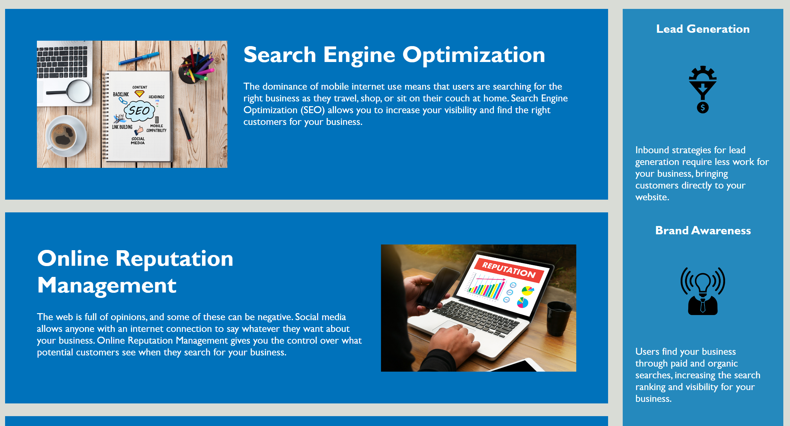

# Horiseon SEO Website

## Description

- I am motivated to modify this code in order to get this website working as well as expand on my HTML and CSS ability
- I edited this project because I wanted to see all the links working, proper ALT tags added to images, and commented the code to make it easy to see what code is affecting what area on the website
- I solved the issue of the website not having links working, proper ALT tags are now in place for images, and the code is commented which makes it easier for the next person to read
- Through doing this activity, I learned more about properly commenting code, adding alt images, how to get a link working when it is not, and how to create a proper README!

## Installation

- No installation is required, just use the URL as it is already available using GitHub Pages

## Usage

- The use of this website is to let customers know what Horiseon SEO Website can do to help their business grow.

- Clicking on the links in the nav bar will take a user to that place on the website.
- The rest of the page is static information

## Credits

N/A

## License

- Please refer to the LICENSE in the repo.

